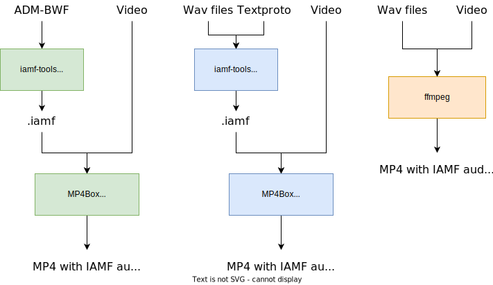

# iamf-tools

## What is IAMF?

The [Immersive Audio Model and Formats](https://aomediacodec.github.io/iamf/)
(IAMF) standard is defined by the Alliance for Open Media (AOM).

## What is `iamf-tools`?

`iamf-tools` implements tools to help users process and work with the IAMF
format. These tools can be used as a complement to the `libiamf`
[reference decoder](https://github.com/AOMediaCodec/libiamf/) and other tools
such as [ffmpeg](https://ffmpeg.org/).

### Encoding IAMF files

There are multiple workflows for creating IAMF files, supporting different types
of inputs.



-   [Encode an ADM-BWF file to IAMF](#using-the-encoder-with-adm-bwf-input)
-   [Encode wav files to IAMF using the iamf-tools encoder](#using-the-encoder-with-wav-files-and-proto-input)
-   [Encode wav files to IAMF using ffmpeg](docs/external/encoding_with_external_tools.md#encode-wav-files-to-iamf-with-ffmpeg)
-   [Merge IAMF files and video into an mp4 file](docs/external/encoding_with_external_tools.md#merge-an-iamf-file-with-video-into-mp4-using-ffmpeg)

### Decoding IAMF files

The `libiamf` reference decoder is available at
https://github.com/AOMediaCodec/libiamf/.

### Web Demo

The [web demo](https://aomediacodec.github.io/iamf-tools/web_demo/) hosted in
the GitHub Pages of this repo decodes and renders standalone IAMF files to
stereo and binaural wav files for preview and comparison.

## Encoder

The encoder can be used to encode a standalone IAMF Sequence (`.iamf`) file from
a set of multichannel wav files or an ADM-BWF file.

### Building the encoder

See [Build instructions](docs/build_instructions.md) to build from source.

### Using the encoder with wav files and proto input

The `iamf-tools` encoder can be used to encode a set of multichannel wav files
into an IAMF file. An accompanying input textproto file serves as the
configuration file, specifying details such as channel layout, mix gains and
codec to use for the underlying audio elements.

Prepare up to two multichannel wav files and the input textproto file. See
[Textproto templates](iamf/cli/textproto_templates) for some example input
textprotos and details on how to customize them.

Run the encoder. Specify the input file with `--user_metadata_filename`.

Optional flags:

-   `--input_wav_directory` controls the directory wav files are read from
    (default `iamf/cli/testdata/`).
-   `--output_iamf_directory` controls the output directory of the IAMF files.

Using the encoder:

```
bazel-bin/iamf/cli/encoder_main --user_metadata_filename=iamf/cli/testdata/test_000002.textproto --output_iamf_directory=.
```

If this example is successful the encoder will produce an output
`test_000002.iamf` file in the current directory.

### Using the encoder with ADM-BWF input

Run the encoder. Specify the input file with `--adm_filename`. See the
`adm_to_user_metadata` [README.md](iamf/cli/adm_to_user_metadata) for details on
the conversion.

> [!WARNING]
>
> Some ADM conversions are a work in progress and are experimental
> (b/392958726).

Optional flags:

-   `--output_iamf_directory` controls the output directory of the IAMF files.
-   `--adm_importance_threshold` controls the threshold below which ADM
    `audioObject`s are omitted (default 0).
-   `--adm_frame_duration_ms` controls the frame size of the output IAMF in ms
    (default 10).

```
bazel-bin/iamf/cli/encoder_main --adm_filename=path/to/adm.wav --output_iamf_directory=.
```

The encoder will produce an output `.iamf` file in the output directory, where
the underlying audio streams are encoded with PCM.

## License

Released under the BSD 3-Clause Clear License. See [LICENSE](LICENSE) for
details.
